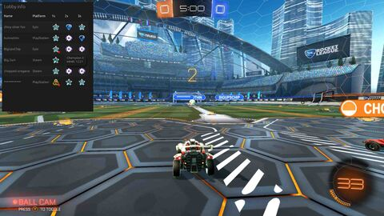

# Rocket League lobby ranks

An overlay which displays the ranks of everyone in your lobby.

> usage in casual

## usage

First, make sure that the stats api is enabled. The instructions are [here](https://www.rocketleague.com/developer/stats-api#configuration). Set the packet rate to whatever, 1 is fine, but don't change the port. Then, start rocket league and the app.

You can manually open the overlay with `Alt`, it will disappear when you release. It automatically pops up for a few seconds when a game starts.
